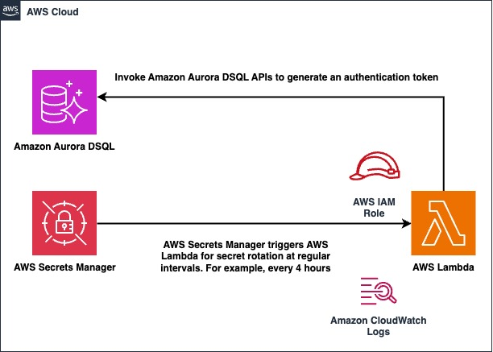

# Amazon Aurora DSQL with AWS Secrets Manager

## Overview

This project shows the integration of a Java application and AWS Secrets Manager with scheduled secret rotation for
Amazon Aurora DSQL.

## Architecture



## Pre-requisites

1. Create an Amazon Aurora DSQL cluster, we are using AWS region `us-east-1` for this example
2. Execute the [schema.sql](demo-app/schema.sql) on the newly created Amazon Aurora DSQL cluster
3. The project has been built and tested using below configurations on `x86` architecture

   a. Java - `v17.0.14` and Gradle - `v8.13`

    ```shell
    # Install SDKMAN - https://sdkman.io/install/
    curl -s "https://get.sdkman.io" | bash
    sdk install java 17.0.14-amzn
    sdk install gradle 8.13
    ```
   b. Python - `v3.13`

    ```shell
    # Install pyenv
    curl https://pyenv.run | bash

    # Install Python 3.13
    pyenv install 3.13
    pyenv global 3.13
    ```

   c. AWS CDK - `v2.1006.0`
    ```shell
    # Install NVM
    curl -o- https://raw.githubusercontent.com/nvm-sh/nvm/v0.40.1/install.sh | bash

    # Install Node LTS
    nvm install --lts

    # Install AWS CDK
    npm install -g aws-cdk@2.1006.0
    ```

   d. Install `curl` and `jq`
    ```shell
    sudo dnf install curl jq
    ```

   e. Install [Docker](https://docs.docker.com/get-started/get-docker/) for building containers
  
   f. Install [AWS CLI](https://docs.aws.amazon.com/cli/latest/userguide/getting-started-install.html)

## Deployment

1. Refer the [CDK infrastructure stack](infrastructure/README.md) to set up secret rotation and store the credentials in AWS Secrets Manager for Amazon Aurora DSQL
2. Refer the [demo application](demo-app/README.md) to build and test REST APIs interacting with your Amazon Aurora DSQL using `curl` commands

## Clean up

1. Shutdown the locally running Spring Boot application
2. Delete the [CDK infrastructure stack](infrastructure/README.md)
3. Delete the Amazon Aurora DSQL cluster

# Security

See [CONTRIBUTING](./CONTRIBUTING.md#security-issue-notifications) for more information.

# License

This library is licensed under the MIT-0 License. See the [LICENSE](./LICENSE) file.